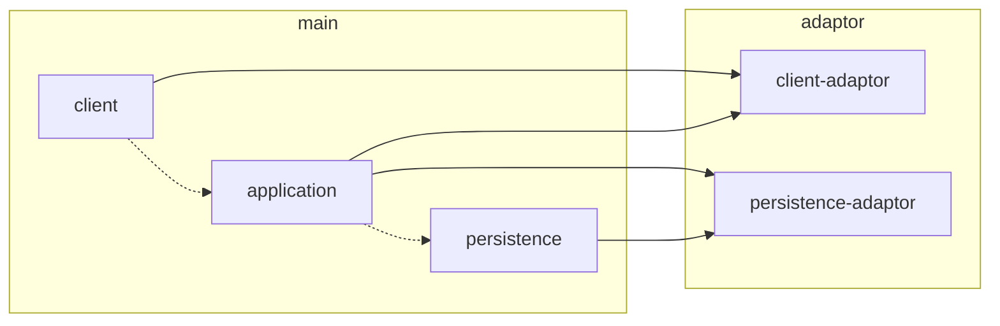

# gas-line-bot-template.ts

## Architecture



## Requirement

```bash
clasp -v
2.4.1
```

```bash
node -v
v18.0.0
```

```bash
npm -v
8.6.0
```

## Prepare

### Init

```bash
clasp create --type standalone
```

### Install

```bash
npm ci
```

## Build

```bash
npm run build
```

## Deploy

```bash
npm run deploy
```
